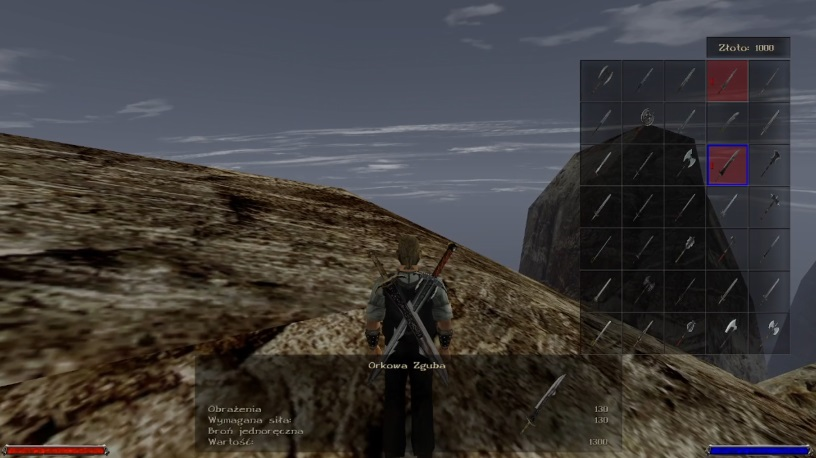

# zDualWielding

## Description

<b>zDualWielding</b> is an Union plugin for Gothic game, that allows
the Player to equip two one-handed weapons at once as well as use them
in combat.

## Features

* Works with any one-handed weapon
* Works on any NPC
* Damage is calculated based on attack direction:
  * Right - damage from weapon in right hand
  * Left - damage from weapon in left hand
  * Front - sum of damages from both weapons
* When both weapons are equipped, player can still equip and use 
a ranged weapon

## Dependencies

* [Union](https://github.com/Gratt-5r2/UnionProject)

## Usage

Use as any other Union plugin. Requires an [MDS](https://themodders.org/index.php?board=466.0)
"Humans_Dual.mds" with proper animations to be present inside games data 
files (not included).
